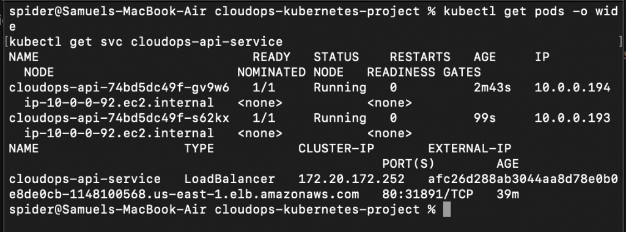
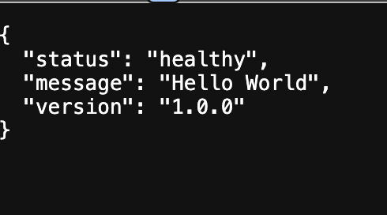

# CloudOps Kubernetes Metadata API

A production-grade cloud-native platform demonstrating the separation of infrastructure provisioning (Terraform) from container workload orchestration (Kubernetes). 

The service runs a lightweight Python FastAPI application deployed to an AWS EKS cluster, leveraging the **Kubernetes Downward API** to dynamically inject runtime cluster metadata (pod name, namespace, pod IP, node host) into the application layer without coupling it to external discovery services.

---

## Architecture Overview

```text
       Internet
          │
          ▼
   [ AWS NLB / ELB ]
          │
          ▼
   [ Kubernetes Service ] (k8s/service.yaml)
          │
          ▼
   [ Kubernetes Pods ]   (k8s/deployment.yaml)
   ├── Injected via Downward API:
   │   ├── POD_NAME
   │   ├── POD_NAMESPACE
   │   ├── POD_IP
   │   └── NODE_NAME
   └── FastAPI REST Endpoint (port 8000)

```
### Proof 1: EKS Infrastructure Provisioning


### Proof 2: Kubernetes Workloads & LoadBalancer Service


### Proof 3: Live API Response

